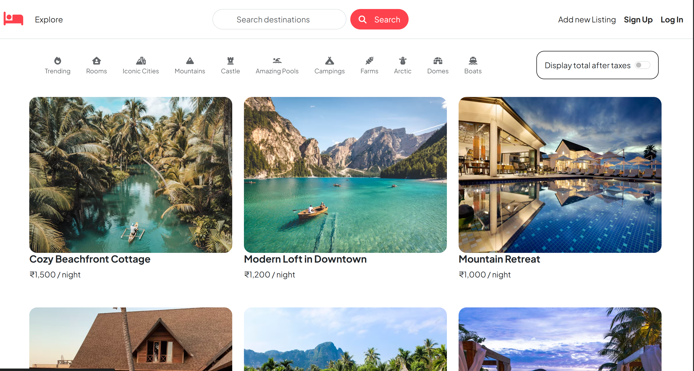
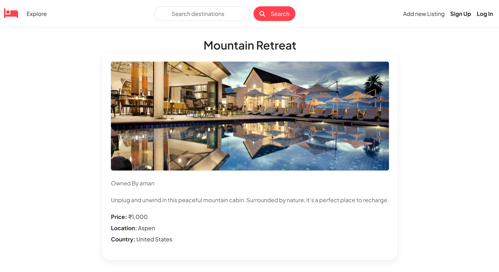

## 🏡 StayEase – Discover and Share Beautiful Stays

**StayEase** is a full-stack web application where users can explore, list, and review unique places to stay around the world. Whether you're looking for a beachfront cottage or a mountain retreat, StayEase makes it easy to browse, manage, and share amazing travel accommodations.

---

### 🌐 Live Site

🔗 [Visit StayEase](https://stayease-ju1z.onrender.com/listings)

---

### 📸 Screenshots

#### 🗂️ All Listings Page



#### 📄 Single Listing View



> 💡 Place your screenshots in a folder named `screenshots/` in your project root.

---

### ⚙️ Tech Stack

* **Frontend:** HTML, EJS, CSS, Bootstrap
* **Backend:** Node.js, Express.js
* **Database:** MongoDB Atlas
* **Authentication:** Passport.js
* **Sessions:** Stored securely with connect-mongo
* **Cloud Storage:** Cloudinary for image uploads
* **Mapping:** Mapbox for location services

---

### 🚀 Key Features

* 🧭 Browse listings with filters by location and price
* 🖼️ Upload property images using Cloudinary
* 🧾 View detailed information about each stay
* 🔐 Register and log in with secure sessions
* ✍️ Leave reviews on listings
* 🛠️ Listing ownership and permissions
* 🗺️ View listings on interactive maps (Mapbox)

---

### 🧪 Project Setup

1. **Clone the repository**

```bash
git clone https://github.com/your-username/stayease.git
cd stayease
npm install
```

2. **Create a `.env` file in the root:**

```env
ATLASDB_URL=your_mongodb_connection_string
CLOUDINARY_CLOUD_NAME=your_cloudinary_name
CLOUDINARY_API_KEY=your_cloudinary_key
CLOUDINARY_API_SECRET=your_cloudinary_secret
SESSION_SECRET=your_custom_secret
```

3. **Start the app**

```bash
node app.js
```

---

### 📂 Project Structure

```bash
StayEase/
├── models/         # Mongoose models
├── routes/         # Route handlers
├── views/          # EJS templates
├── public/         # Static assets
├── init/           # DB seeding scripts
├── utils/          # Custom error handling
├── app.js          # Main server file
├── .env            # Environment variables
├── README.md
```

---

### 🧑‍💻 Developer

Made with ❤️ by **Harsh Singh**
[GitHub](https://github.com/mewillsh) · [LinkedIn](https://www.linkedin.com/in/harsh-singh-3505961b2/)

---

### ✅ To Do Next

* [ ] Add user dashboards
* [ ] Advanced search with filters
* [ ] Booking calendar system
* [ ] Payment integration (Stripe/Razorpay)

